# Sirius Pulse 完整架构流程

> **v1.0 多人格架构的真实执行路径与模块边界**
>
> 本文档用人类易读的方式，从"一条消息怎么被处理"到"整个系统怎么运转"，完整描述 Sirius Pulse 的架构。流程图使用 Mermaid 语法，可在支持 Mermaid 的编辑器或浏览器中渲染。

---

## 第一章：系统全景图

### 1.1 你在看什么

Sirius Pulse 是一个**支持多人格启用的异步角色扮演程序**。想象一个 QQ 群里同时有几个不同的 AI 角色在聊天——有的活泼、有的高冷、有的毒舌——每个人格独立运行、独立记忆、独立配置。

### 1.2 进程模型

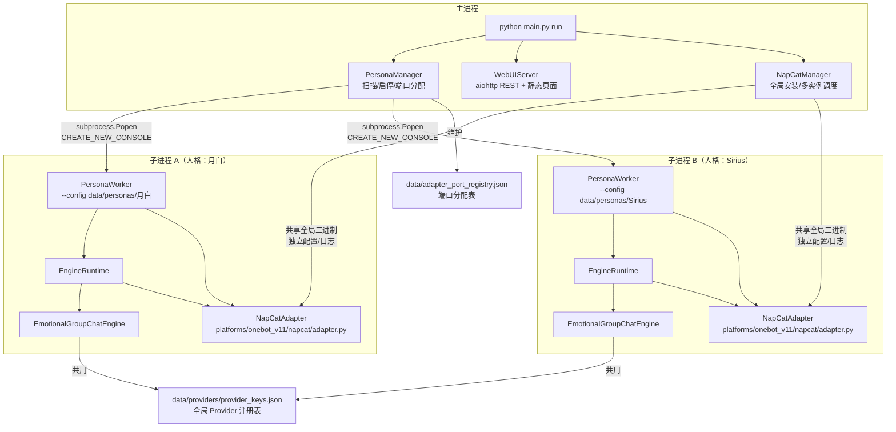

### 1.3 关键设计决策

| 决策 | 说明 |
|------|------|
| **独立子进程** | 每个人格一个独立进程，崩溃不影响其他人格 |
| **数据隔离** | 每个人格有自己的目录 `data/personas/{name}/`，记忆、配置、日志完全隔离 |
| **Provider 共享** | 所有人格共用 `data/providers/provider_keys.json`，避免重复配置 API Key |
| **NapCat 多实例** | 每个人格独立的 QQ 实例，共享全局二进制，独立配置和日志 |
| **端口自动分配** | `PersonaManager` 从 3001 开始递增分配 WebSocket 端口 |

---

## 第二章：主进程启动流程

### 2.1 从命令行到运行

```bash
python main.py run
```

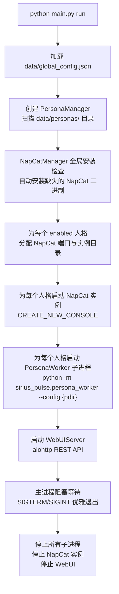

### 2.2 主进程三大组件

**PersonaManager（人格管家）**
- `create_persona(name)` — 创建新人格目录和默认配置
- `start_persona(name)` — 启动单个人格（含 NapCat 自动管理）
- `run_all()` — 批量启动所有 enabled 人格
- `get_logs(name)` — 读取子进程日志
- `get_status(name)` — 读取子进程心跳状态

**WebUIServer（管理面板）**
- 提供 REST API：人格列表、状态、配置、日志
- 提供静态页面：Dashboard + 配置面板
- 不直接操作 NapCat 进程，只通过 API 与 PersonaManager 交互

**NapCatManager（QQ 管理器）**
- 管理 NapCat 全局二进制（安装、更新）
- 为每个人格创建独立实例目录
- 启动/停止 NapCat 进程

---

## 第三章：人格子进程启动流程

### 3.1 子进程内部发生了什么

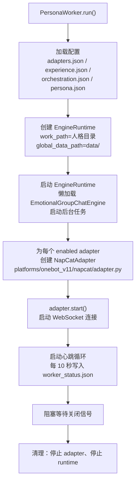

### 3.2 子进程内的关键协作

- 所有 bridge 共享同一个 `EngineRuntime` 和同一个 `EmotionalGroupChatEngine`
- 每个 bridge 有自己的 `allowed_group_ids` 配置
- engine 的 `_pending_reminders` 是共享的（所有 bridge 都能投递提醒）

---

## 第四章：消息处理完整流程

### 4.1 一条消息的一生

假设群里有人发了一条消息："今天工作好累"，看看它怎么被处理。

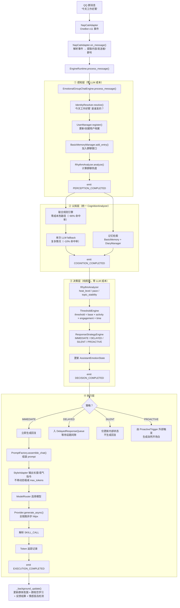

### 4.2 认知层内部细节

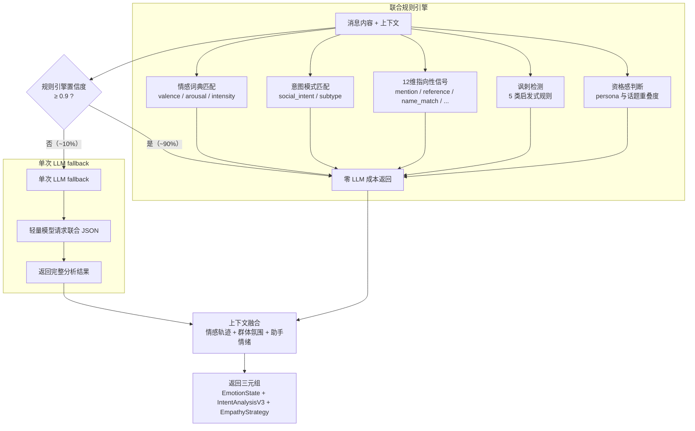

### 4.3 延迟回复的触发

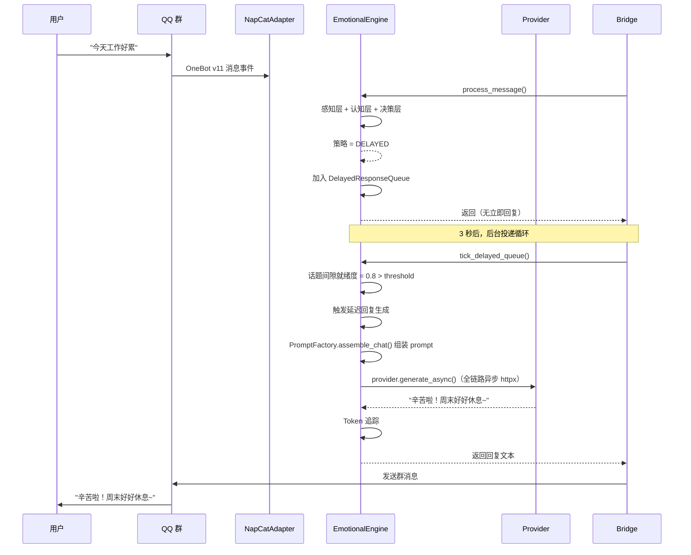

### 4.4 四种响应策略的触发条件

| 策略 | 触发场景 | 行为 |
|------|---------|------|
| **IMMEDIATE** | 被 @、紧急求助、高 relevance | 立即生成并发送回复 |
| **DELAYED** | 一般性对话、话题间隙不够 | 加入队列，等自然间隙再回 |
| **SILENT** | 无关话题、低 relevance、冷却中 | 不回复，只后台学习 |
| **PROACTIVE** | 群聊沉默过久、记忆触发、情感触发 | 主动发起新话题 |

---

## 第五章：后台任务系统

### 5.1 引擎后台任务

引擎内置 6 个后台任务，另有被动 SKILL 注册的任务（如 reminder）并行运行：

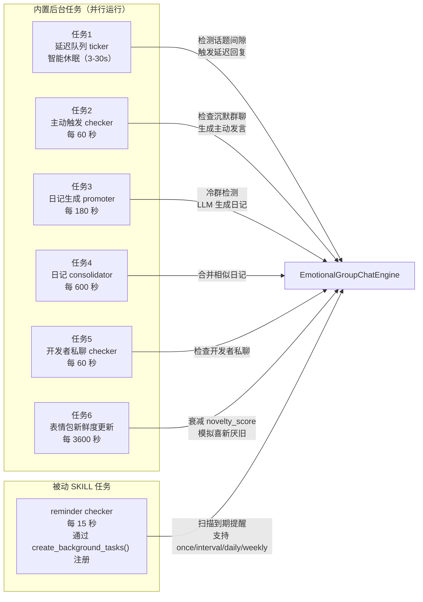

### 5.2 提醒系统完整链路

提醒是一个**双模式 SKILL**：主动模式由模型调用 `run()` 创建/管理提醒，被动模式通过 `create_background_tasks(ctx)` 注册周期性检查任务。

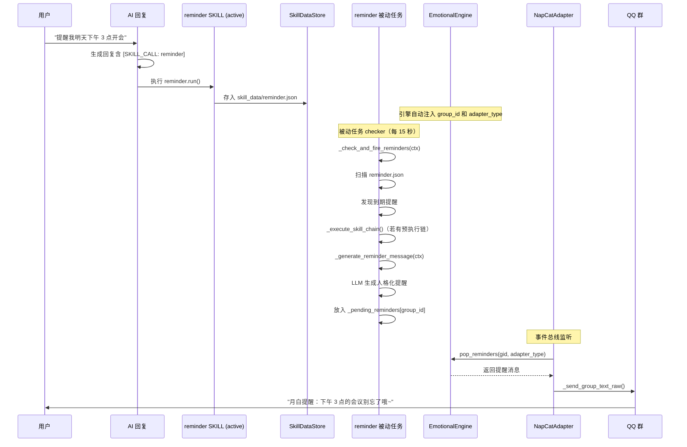

---

## 第六章：数据流与存储

### 6.1 全局共享数据

| 路径 | 说明 | 谁读写 |
|------|------|--------|
| `data/global_config.json` | WebUI 参数、NapCat 管理、日志级别 | 主进程读写 |
| `data/providers/provider_keys.json` | Provider 凭证（所有人格共用） | 主进程/子进程读 |
| `data/adapter_port_registry.json` | NapCat 端口分配表 | PersonaManager 维护 |

### 6.2 人格隔离数据

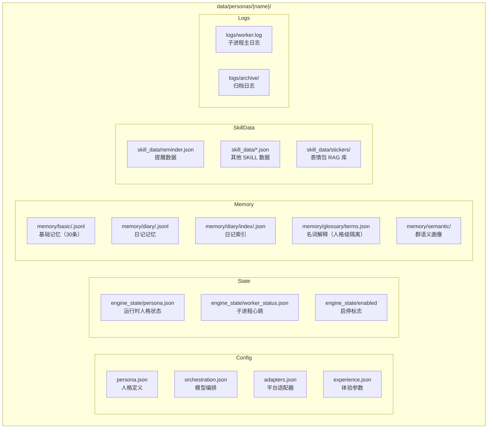

### 6.3 NapCat 多实例数据

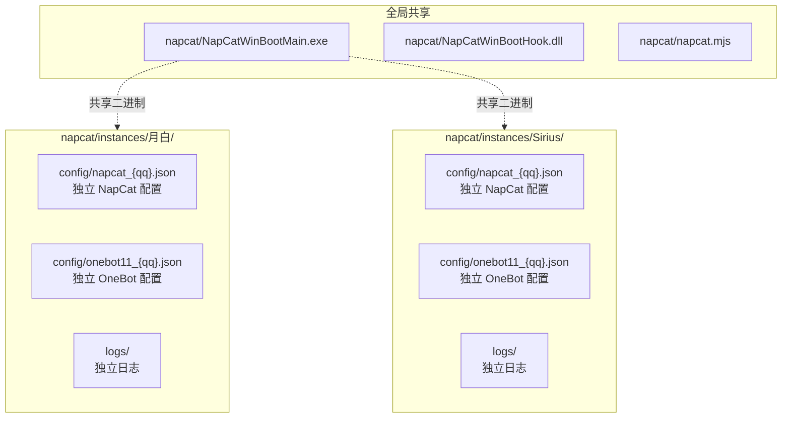

---

## 第七章：事件总线

引擎在处理每条消息时发射事件，外部可以订阅：

```python
from sirius_pulse.core.events import SessionEventType

async for event in engine.event_bus.subscribe():
    if event.type == SessionEventType.PERCEPTION_COMPLETED:
        print(f"感知完成：{event.data['group_id']}")
    elif event.type == SessionEventType.COGNITION_COMPLETED:
        print(f"认知完成：情绪={event.data['emotion']}")
    elif event.type == SessionEventType.DECISION_COMPLETED:
        print(f"决策完成：策略={event.data['strategy']}")
    elif event.type == SessionEventType.EXECUTION_COMPLETED:
        print(f"执行完成：回复={event.data['reply']}")
```

**事件类型**：

| 事件 | 触发时机 | 数据 |
|------|---------|------|
| `PERCEPTION_COMPLETED` | 感知层完成后 | group_id, user_id, message |
| `COGNITION_COMPLETED` | 认知层完成后 | emotion, intent, empathy |
| `DECISION_COMPLETED` | 决策层完成后 | strategy, threshold |
| `EXECUTION_COMPLETED` | 执行层完成后 | reply, tokens_used |
| `DELAYED_RESPONSE_TRIGGERED` | 延迟回复触发时 | group_id, original_message |
| `PROACTIVE_RESPONSE_TRIGGERED` | 主动发言触发时 | group_id, trigger_type |
| `DEVELOPER_CHAT_TRIGGERED` | 开发者私聊主动对话触发时 | group_id, chat_content |
| `REMINDER_TRIGGERED` | 提醒到期时 | group_id, reminder_content |

**有损广播**：如果消费者处理慢了，队列满后事件会被丢弃，不会阻塞引擎。

---

## 第八章：Provider 路由

### 8.1 支持的 Provider 平台

| 平台 | 标识 | 默认 base_url |
|------|------|--------------|
| OpenAI 兼容 | `openai-compatible` | https://api.openai.com |
| 阿里云百炼 | `aliyun-bailian` | https://dashscope.aliyuncs.com/compatible-mode |
| 智谱 AI | `bigmodel` | https://open.bigmodel.cn/api/paas/v4 |
| DeepSeek | `deepseek` | https://api.deepseek.com |
| SiliconFlow | `siliconflow` | https://api.siliconflow.cn |
| 火山方舟 | `volcengine-ark` | https://ark.cn-beijing.volces.com/api/v3 |
| YTea | `ytea` | https://api.ytea.top |

### 8.2 路由规则

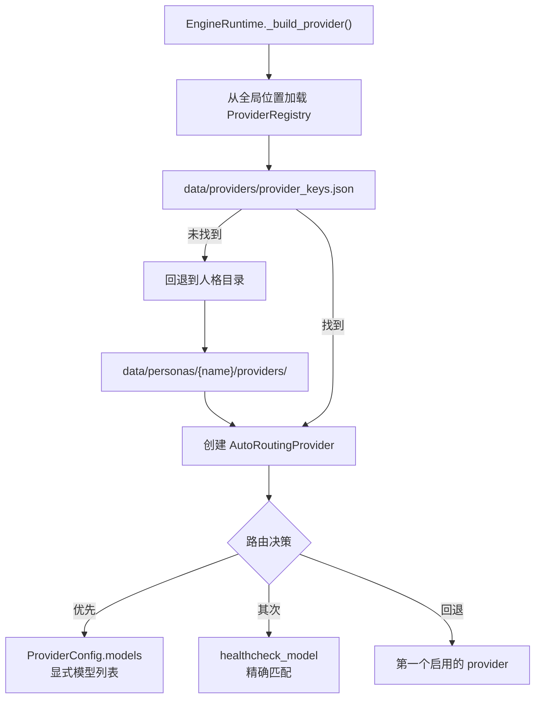

---

## 第九章：模块职责速查表

| 分层 | 模块 | 主要职责 |
|------|------|---------|
| **入口层** | `main.py` | 统一 CLI：无参数启动 WebUI；`run` 启动所有人格；`persona` 管理单个人格 |
| **主进程管理** | `persona_manager.py` | 多人格生命周期：扫描、创建、删除、迁移、启停、监控 |
| **子进程入口** | `persona_worker.py` | 单个人格运行入口：加载配置、创建 EngineRuntime、启动 Bridge、心跳 |
| **子进程运行时** | `platforms/runtime.py` | EngineRuntime：懒加载引擎，管理 provider 和 skill bridge |
| **平台适配** | `platforms/onebot_v11/napcat/adapter.py` | NapCat 适配器（OneBot v11 WebSocket 客户端、事件处理、后台投递循环） |
| **QQ 管理** | `platforms/onebot_v11/napcat/manager.py` | NapCat 全局安装、多实例调度 |
| **协议解析** | `platforms/onebot_v11/protocol.py` | OneBot v11 协议解析 |
| **认知编排** | `core/emotional_engine.py` | Mixin 架构引擎（engine_core + pipeline + prompt_factory + bg_tasks + helpers） |
| **引擎核心** | `core/engine_core.py` | 引擎基类：__init__、公开 API、持久化、表情包系统初始化 |
| **引擎管线** | `core/pipeline.py` | 5 阶段管线：感知→认知→决策→执行→后台更新 |
| **Prompt 工厂** | `core/prompt_factory.py` | 无状态 PromptFactory：统一 prompt 拼装、StyleAdapter 风格适配、PromptBundle |
| **引擎后台任务** | `core/bg_tasks.py` | 6 个后台任务：延迟队列、主动触发、日记生成/合并、开发者私聊、表情包新鲜度 |
| **引擎辅助** | `core/helpers.py` | 技能集成（含被动 SKILL 注册与触发分发）、上下文辅助、用户画像分析、token 记录、异常分类 |
| **认知分析** | `core/cognition.py` | 统一情绪+意图分析、规则引擎+LLM fallback |
| **响应策略** | `core/response_strategy.py` | 四种策略选择（IMMEDIATE/DELAYED/SILENT/PROACTIVE） |
| **动态阈值** | `core/threshold_engine.py` | 阈值计算：base × activity × engagement × time |
| **对话节奏** | `core/rhythm.py` | 热度、速度、话题稳定性、间隙就绪度 |
| **Prompt 组装** | `core/response_assembler.py` | *(已迁移至 PromptFactory)* |
| **基础记忆** | `memory/basic/` | 滑动窗口（30条硬限制）、热度计算、归档 |
| **日记记忆** | `memory/diary/` | LLM 生成摘要、关键词/嵌入索引、ChromaDB 向量存储、token 预算检索 |
| **Embedding 服务** | `embedding/` | Embedding 微服务：aiohttp 服务端（批量合并推理）+ 同步客户端，DiaryIndexer / StickerIndexer 通过 EmbeddingClient 调用 |
| **人格生成** | `persona_generation/` | 人格资产生成子包（templates 数据模型 + builders LLM 生成），原顶层 prompt_templates / roleplay_prompting 迁移至此 |
| **用户管理** | `memory/user/` | 极简 UserProfile、群隔离、跨平台身份追踪 |
| **名词解释** | `memory/glossary/` | AI 自身知识库，支持人格级隔离与迁移 |
| **语义记忆** | `memory/semantic/` | 群氛围、群规范、反馈驱动的互动率追踪 |
| **上下文组装** | `memory/context_assembler.py` | 基础记忆+日记 → OpenAI messages |
| **Provider 层** | `providers/` | 统一请求协议、7 个平台实现、自动路由 |
| **插件系统** | `plugins/` | 插件加载、注册表、执行器、配置管理、@command 装饰器、PluginContext、响应调度、事件定义 |
| **SKILL 层** | `skills/` | 注册、执行、数据存储、依赖解析、内置技能、遥测；被动 SKILL 支持（BackgroundTaskSpec/TriggerSpec/SkillEngineContext） |
| **SKILL 引擎上下文** | `core/skill_engine_context.py` | SkillEngineContextImpl：被动 SKILL 与引擎交互的适配器 |
| **表情包系统** | `skills/sticker/` | RAG 表情包：向量索引、偏好管理、学习、反馈观察、新鲜度 |
| **配置层** | `config/` | 类型安全的配置契约、加载器、helpers、JSONC |
| **WebUI 层** | `webui/` | aiohttp REST API（server_core + 4 个 API 模块）+ 管理面板（16 个页面） |
| **Token 层** | `token/` | 统计、SQLite 持久化、多维分析 |
| **会话存储** | `session/store.py` | JsonSessionStore / SqliteSessionStore / SessionStoreFactory |
| **后台任务** | `background_tasks.py` | 轻量级 asyncio 任务调度器 |
| **工具函数** | `utils/` | WorkspaceLayout、JsonSerializable mixin、开发辅助 |
