# Sirius Chat Plugin 系统架构设计文档

> **版本**: v1.0-draft  
> **状态**: 设计阶段  
> **目标**: 在保留现有 ActiveSkill / PassiveSkill 的基础上，引入面向关键词指令与事件触发的 Plugin 扩展层，支持可选 LLM 风格化生成、多平台 Adapter 接入、以及文件夹级插件包结构。

---

## 目录

1. [设计目标与定位](#1-设计目标与定位)
2. [与现有系统的边界](#2-与现有系统的边界)
3. [核心架构概览](#3-核心架构概览)
4. [词法分析与指令解析层](#4-词法分析与指令解析层)
5. [Plugin 包结构与加载机制](#5-plugin-包结构与加载机制)
6. [Plugin 运行时与执行模型](#6-plugin-运行时与执行模型)
7. [输出策略：直接回复 vs LLM 风格化](#7-输出策略直接回复-vs-llm-风格化)
8. [多平台 Adapter 接口](#8-多平台-adapter-接口)
9. [事件系统与主动消息](#9-事件系统与主动消息)
10. [安全与权限模型](#10-安全与权限模型)
11. [Pipeline 集成点](#11-pipeline-集成点)
12. [MVP 实施路线图](#12-mvp-实施路线图)
13. [自然语言意图识别（无 LLM）](#13-自然语言意图识别无-llm)
14. [与现有 CognitionAnalyzer 的融合](#14-与现有-cognitionanalyzer-的融合)

---

## 1. 设计目标与定位

### 1.1 解决什么问题

现有 Sirius Chat 的扩展能力分为两层：

- **ActiveSkill**: AI 自主决定调用，走 `[SKILL_CALL:...]` 标记，结果直出，不经过人格风格化。
- **PassiveSkill**: 旁路定时任务或事件监听，直接执行 Python 函数，自行处理输出。

这两层都无法优雅地处理以下场景：

| 场景 | 现有方案缺陷 |
|------|-------------|
| 用户输入 `/天气 北京` | ActiveSkill 需要 AI "猜到" 要调用天气查询；PassiveSkill 没有关键词路由 |
| 骰子 Bot `#roll 2d6+3` | 不应消耗 LLM token 做意图识别，需要精确词法解析 |
| 每日早安推送 | PassiveSkill 只能硬编码文本，无法享受人格风格化 |
| GitHub Webhook 推送 PR 提醒 | PassiveSkill 缺乏结构化数据到人格化表达的转换层 |
| 插件需要访问 QQ 群成员列表 | Skill/PassiveSkill 的 bridge 注入过于受限 |

### 1.2 Plugin 系统的核心定位

> **Plugin 是用户/事件驱动的指令响应系统。它提供精确的词法路由、可选的人格风格化生成、以及丰富的平台 Adapter 接口。**

三个关键设计决策：

1. **指令触发后，跳过传统 Pipeline 的 cognition/decision**：因为指令语义已明确，无需再让 LLM 做意图识别和策略决策。
2. **LLM 风格化生成是可选 API**：Plugin 可以直接返回最终文本（适合骰子、计算器等确定性场景），也可以返回结构化数据让引擎代为生成（适合天气、新闻等需要人格化表达的场景）。
3. **插件以文件夹形式组织**：支持多文件、子模块、静态资源、独立依赖，突破单 `.py` 文件的限制。

---

## 2. 与现有系统的边界

### 2.1 三层扩展能力对比

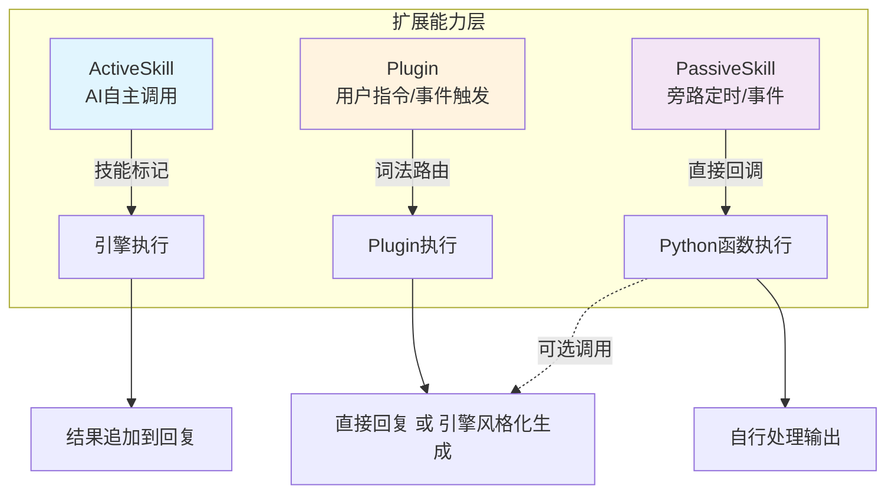

### 2.2 详细对比矩阵

| 维度 | ActiveSkill | Plugin | PassiveSkill |
|------|-------------|--------|--------------|
| **触发方式** | AI 在生成中嵌入 `[SKILL_CALL:...]` | 用户关键词/前缀/正则；外部事件 | 定时循环 `BackgroundTaskSpec`；事件 `TriggerSpec` |
| **调用路径** | `_execution()` 内 `_process_skill_calls()` | **独立路径**：词法解析 -> 执行 -> 输出 | `_dispatch_passive_triggers()` 旁路调用 |
| **是否走 Pipeline** | 是（已在 execution 内） | **否**（跳过 cognition/decision） | 否 |
| **意图识别** | LLM 自主判断 | **词法分析器精确匹配** | 无（直接绑定事件类型） |
| **人格风格化** | 无（结果直出） | **可选**（`render_mode: direct/llm`） | 无（自行处理） |
| **输出控制** | SKILL 返回什么就追加什么 | Plugin 决定：直接回复 / 委托引擎生成 | 自行调用 `queue_pending_message` 或 `generate_text` |
| **平台接口** | 有限（bridge 注入） | **丰富**（NapCatAdapter 原生 API 暴露） | 有限 |
| **文件组织** | 单 `.py` 文件 | **文件夹级**（`__init__.py` + 子模块 + 资源） | 单 `.py` 文件 |
| **依赖管理** | `SKILL_META.dependencies` | **`_plugin_dependencies` 类属性** | 同 ActiveSkill |
| **适用场景** | 工具调用、信息查询、链式操作 | 命令 Bot、骰子、定时推送、Webhook | 后台监控、数据同步、日志 |

---

## 3. 核心架构概览

### 3.1 系统全景图

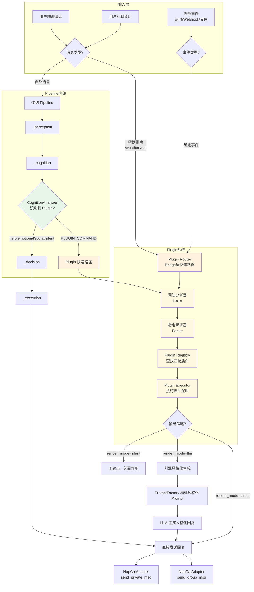

### 3.2 Plugin 内部数据流

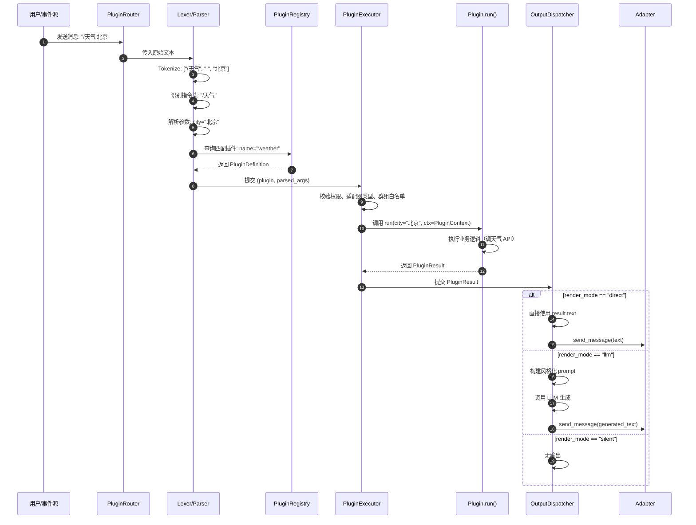

---

## 4. 词法分析与指令解析层

### 4.1 设计原则

Plugin 的指令解析必须**精确、高效、可扩展**。不依赖 LLM 做意图识别，而是在字符串层面完成所有解析工作。

### 4.2 架构图

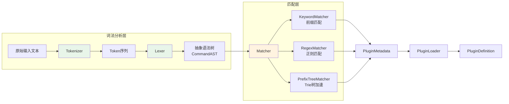

### 4.3 Tokenizer 设计

支持多种指令风格：

| 风格 | 示例 | 说明 |
|------|------|------|
| Unix 风格 | `/weather Beijing --unit=c` | 斜杠前缀，GNU 风格长选项 |
| 前缀风格 | `#roll 2d6+3` | 井号前缀，适合骰子 Bot |
| @ 提及风格 | `@Bot 天气 北京` | 兼容 QQ 的 @ 消息格式 |
| 自然语言触发 | `查一下北京天气` | 关键词前缀匹配 |

```mermaid
graph TD
    subgraph Tokenizer 状态机
        direction LR
        S0[START] -->|"/"| S1[CMD_HEAD]
        S0 -->|"#"| S1
        S0 -->|"@"| S2[MENTION]
        S0 -->|汉字| S3[NATURAL_LANG]
        S0 -->|其他字符| S4[LITERAL]

        S1 -->|字母/数字/_| S1
        S1 -->|空格| S5[ARG_START]

        S2 -->|数字| S2
        S2 -->|空格| S5

        %% 自然语言触发路径
        S3 -->|匹配关键词<br/>"天气"/"提醒"| S1
        S3 -->|不匹配| S4
        S4 -->|匹配关键词| S1

        S5 -->|"--"| S6[LONG_OPT]
        S5 -->|"-"| S7[SHORT_OPT]
        S5 -->|非空格| S8[ARG_VALUE]

        S6 -->|字母/数字/_/-| S6
        S6 -->|"="| S8
        S6 -->|空格| S5

        S7 -->|字母| S7
        S7 -->|空格| S5

        S8 -->|非空格| S8
        S8 -->|空格| S5
    end
```

### 4.4 指令 AST 定义

```
CommandAST
|-- command: str          # 指令名，如 "weather"
|-- raw_text: str         # 原始完整文本
|-- prefix: str           # 触发前缀，如 "/"
|-- args: list[ArgNode]   # 位置参数列表
|-- kwargs: dict[str, ArgNode]  # 命名参数
|-- flags: set[str]       # 布尔开关，如 "--verbose"

ArgNode
|-- value: str | int | float | bool
|-- raw: str              # 原始字符串
|-- type_hint: str        # 来自 Plugin 参数定义的类型提示
```

### 4.5 参数解析策略

```mermaid
graph TD
    subgraph 参数解析流程
        direction TB
        A[PluginDefinition.parameters] --> B[按定义顺序解析]
        B --> C{参数类型?}

        C -->|str| D[原样传递]
        C -->|int| E[int(value)]
        C -->|float| F[float(value)]
        C -->|bool| G["true/1/yes -> True"]
        C -->|list[str]| H[逗号或空格分割]
        C -->|UserMention| I[解析 @QQ号 -> user_id]
        C -->|GroupMention| J[解析群号]
        C -->|MessageReference| K[解析回复消息ID]

        D --> L[类型校验]
        E --> L
        F --> L
        G --> L
        H --> L
        I --> L
        J --> L
        K --> L

        L -->|校验通过| M[构建 call_params]
        L -->|校验失败| N[返回参数错误]
    end
```

### 4.6 特殊参数类型（平台感知）

```python
# Plugin 可以声明需要平台原生对象的参数类型
# 框架自动从事件中提取并注入

@dataclass
class UserMention:
    """被 @ 的用户"""
    user_id: str
    nickname: str
    group_card: str | None = None

@dataclass
class GroupMention:
    """群聊上下文"""
    group_id: str
    group_name: str | None = None

@dataclass
class MessageReference:
    """回复的消息引用"""
    message_id: str
    sender_id: str
    original_content: str

@dataclass
class ImageAttachment:
    """消息中的图片"""
    url: str
    local_path: str | None = None
    is_sticker: bool = False
```

---

## 5. Plugin 包结构与加载机制

### 5.1 目录结构

```
data/personas/{persona_name}/
|-- skills/                      # 现有 SKILL 目录（单文件）
|-- plugins/                     # 新增 Plugin 目录（文件夹级）
|   |-- README.md
|   |-- __plugin_index__.json    # 插件索引（自动生成）
|   |
|   |-- weather/                 # 天气查询插件
|   |   |-- __init__.py          # PluginBase 子类（类属性 + @command 声明元数据）
|   |   |-- api_client.py        # 天气 API 封装
|   |   |-- formatters.py        # 数据格式化
|   |   |-- templates/           # 静态模板
|   |   |   |-- default.txt
|   |   |-- requirements.txt     # 独立依赖
|   |
|   |-- roll_dice/               # 骰子插件
|   |   |-- __init__.py
|   |   |-- dice_parser.py       # 骰子表达式解析
|   |   |-- requirements.txt
|   |
|   |-- daily_push/              # 每日推送插件
|   |   |-- __init__.py
|   |   |-- scheduler.py         # 定时逻辑
|   |   |-- templates/
|   |
|   |-- github_webhook/          # Webhook 接收插件
|   |   |-- plugin.json
|   |   |-- __init__.py
|   |   |-- webhook_server.py    # 小型 HTTP 服务
|   |   |-- event_handlers.py
|
|-- ...
```

### 5.2 PluginBase 类属性格式（元数据）

```python
from sirius_chat.plugins import PluginBase, PluginResponse
from sirius_chat.plugins.decorators import command


class WeatherPlugin(PluginBase):
    # ── 元数据 ──
    _plugin_name = "weather"
    _plugin_display_name = "天气查询"
    _plugin_description = "查询指定城市的实时天气，支持人格化表达"
    _plugin_version = "1.0.0"
    _plugin_author = "plugin-dev"

    # ── 事件 ──
    _plugin_events = [
        {"type": "timer.daily", "cron": "0 8 * * *", "description": "每日早上8点推送天气"},
    ]

    # ── 权限 ──
    _plugin_permissions = {
        "developer_only": False,
        "adapter_types": ["napcat"],
        "group_whitelist": [],
        "group_blacklist": [],
        "user_whitelist": [],
        "rate_limit": {"calls_per_minute": 10, "calls_per_hour": 100},
    }

    # ── 依赖 ──
    _plugin_dependencies = ["httpx>=0.24.0", "pydantic>=2.0"]

    # ── 指令（@command 装饰器声明） ──
    @command("weather", patterns=["/天气", "查天气", "天气怎么样"],
             render_mode="llm", description="查询城市天气",
             system_prompt_suffix="请以关心的语气告诉用户天气情况，提醒注意穿衣。")
    async def query_weather(self, city: str, unit: str = "celsius") -> PluginResponse:
        data = await self._fetch_weather(city, unit)
        return PluginResponse.ok(data=data)
```

### 5.3 加载流程

```mermaid
graph TD
    subgraph Plugin加载流程
        direction TB
        S[引擎启动] --> D[扫描 plugins/ 目录]
        D --> F{是文件夹?}
        F -->|是| J[导入 .py 文件，查找 PluginBase 子类]
        F -->|否| SKIP[跳过]
        J --> V[通过类属性 + @command 构建 PluginDefinition]
        V -->|失败| ERR1[记录错误，跳过]
        V -->|通过| L[实例化 PluginBase 子类]
        L --> I[on_load()]
        I --> R[注册到 PluginRegistry]
        R --> B[构建触发器索引]
        B --> IDX[KeywordIndex<br/>PrefixTree<br/>RegexIndex<br/>EventIndex]

        ERR1 --> END
        SKIP --> END
        IDX --> END[加载完成]
    end
```

### 5.4 依赖隔离

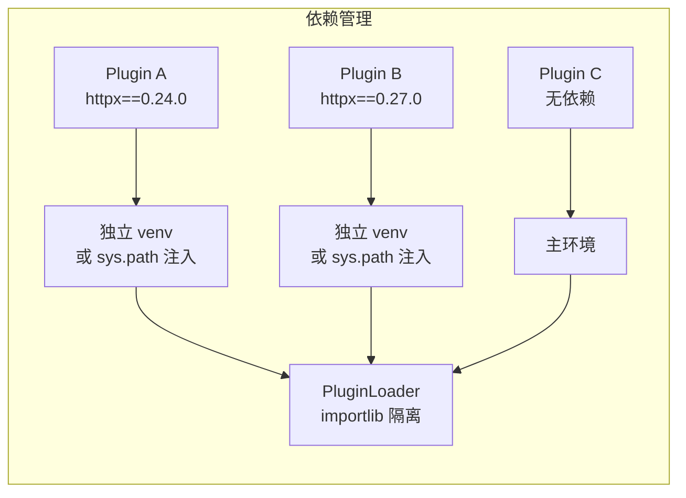

---

## 6. Plugin 运行时与执行模型

### 6.1 Plugin 基类与上下文

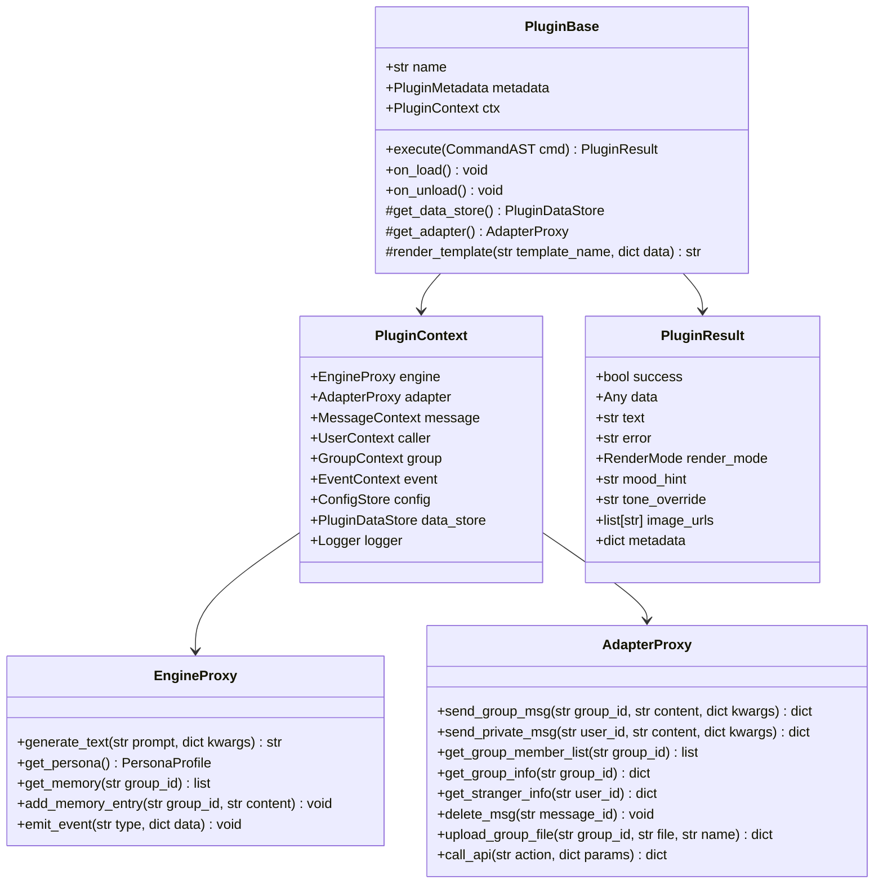

### 6.2 执行生命周期

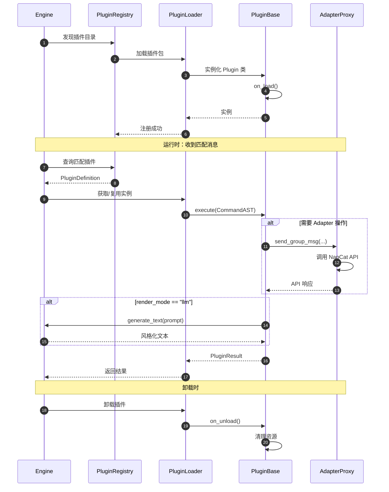

---

## 7. 输出策略：直接回复 vs LLM 风格化

### 7.1 三种 Render Mode

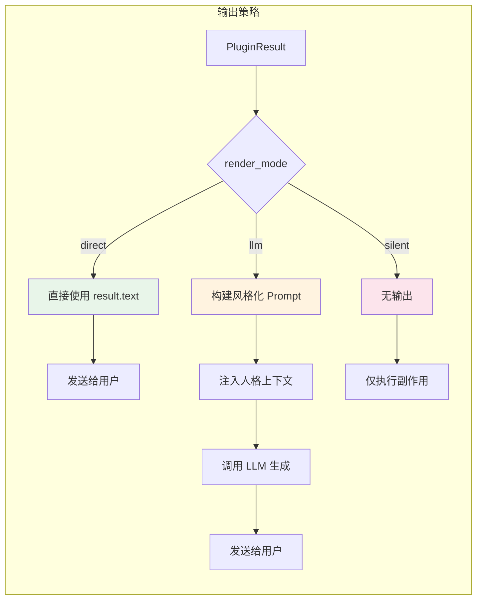

### 7.2 LLM 风格化 Prompt 构建

当 `render_mode="llm"` 时，PromptFactory 构建专门的 Plugin 风格化 prompt：

```
【角色：{persona_name}】
...（标准人格 prompt）...

【指令执行结果】
你刚刚执行了用户的指令，获得以下数据：
{plugin_data_json}

【表达要求】
- 请以自然的人格风格向用户传达以上信息
- 当前情绪提示：{mood_hint}
- 语气要求：{tone_override}
- 长度控制：{length_instruction}
- 不要暴露这是"执行结果"，要像自己知道的一样自然表达
```

### 7.3 决策：何时用 direct，何时用 llm

| 场景 | 推荐模式 | 原因 |
|------|---------|------|
| 骰子 `/roll 2d6` | `direct` | 确定性结果，不需要人格化 |
| 计算器 `/calc 1+1` | `direct` | 纯数学，风格化无意义 |
| 天气查询 `/weather 北京` | `llm` | 需要关心语气、穿衣提醒等 |
| 每日推送 | `llm` | 早安需要人格化表达 |
| 系统状态 `/status` | `direct` | 技术信息，直接输出 |
| 群管理 `/kick @user` | `silent` + `direct` 确认 | 操作后静默，可额外发确认消息 |

---

## 8. 多平台 Adapter 接口

### 8.1 AdapterProxy 设计

Plugin 通过 `AdapterProxy` 访问平台原生能力，而非直接操作 WebSocket：

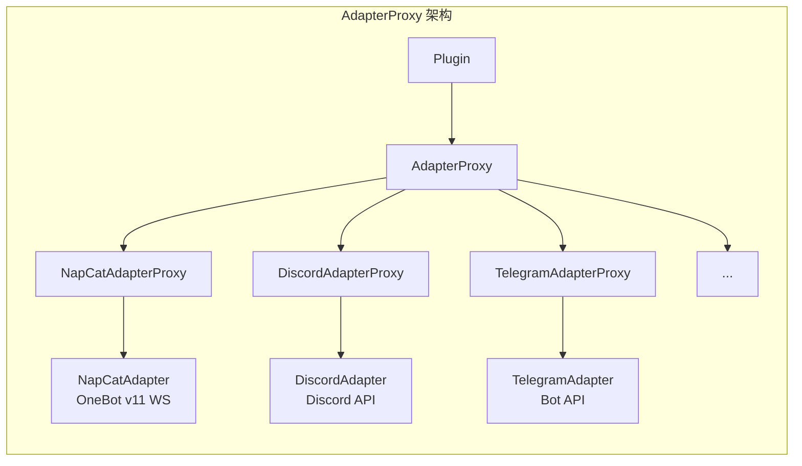

### 8.2 NapCatAdapterProxy 接口清单

```python
class NapCatAdapterProxy(AdapterProxy):
    """NapCat 平台专用接口，暴露 OneBot v11 的全部能力。"""

    # -- 消息发送 --
    async def send_group_msg(self, group_id: str, content: str,
                             *, at_user: str | None = None,
                             reply_to: str | None = None,
                             image_path: str | None = None) -> dict: ...

    async def send_private_msg(self, user_id: str, content: str,
                               *, reply_to: str | None = None,
                               image_path: str | None = None) -> dict: ...

    async def send_group_forward_msg(self, group_id: str,
                                     messages: list[dict]) -> dict: ...

    # -- 消息操作 --
    async def delete_msg(self, message_id: str) -> dict: ...
    async def get_msg(self, message_id: str) -> dict: ...
    async def get_forward_msg(self, message_id: str) -> dict: ...

    # -- 群信息 --
    async def get_group_list(self) -> list[dict]: ...
    async def get_group_info(self, group_id: str) -> dict: ...
    async def get_group_member_list(self, group_id: str) -> list[dict]: ...
    async def get_group_member_info(self, group_id: str, user_id: str) -> dict: ...

    # -- 成员管理 --
    async def set_group_kick(self, group_id: str, user_id: str,
                             reject_add_request: bool = False) -> dict: ...
    async def set_group_ban(self, group_id: str, user_id: str,
                            duration: int = 1800) -> dict: ...
    async def set_group_whole_ban(self, group_id: str, enable: bool = True) -> dict: ...
    async def set_group_admin(self, group_id: str, user_id: str,
                              enable: bool = True) -> dict: ...
    async def set_group_card(self, group_id: str, user_id: str, card: str) -> dict: ...
    async def set_group_name(self, group_id: str, name: str) -> dict: ...

    # -- 文件 --
    async def upload_group_file(self, group_id: str, file: str,
                                name: str, folder: str = "") -> dict: ...
    async def upload_private_file(self, user_id: str, file: str,
                                  name: str) -> dict: ...

    # -- 好友 --
    async def get_friend_list(self) -> list[dict]: ...
    async def get_stranger_info(self, user_id: str) -> dict: ...

    # -- 通用 --
    async def call_api(self, action: str, params: dict) -> dict: ...
```

### 8.3 跨平台兼容性

```mermaid
graph TB
    subgraph 跨平台抽象
        P[Plugin.run()] --> C{检查 adapter_type}

        C -->|napcat| N[NapCatAdapterProxy]
        C -->|discord| D[DiscordAdapterProxy]
        C -->|telegram| T[TelegramAdapterProxy]

        N --> F1[send_group_msg]
        D --> F2[send_channel_msg]
        T --> F3[send_chat_msg]

        F1 --> U[统一语义：发送到群组]
        F2 --> U
        F3 --> U
    end
```

---

## 9. 事件系统与主动消息

### 9.1 事件类型定义

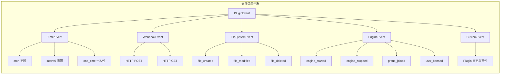

### 9.2 定时事件调度

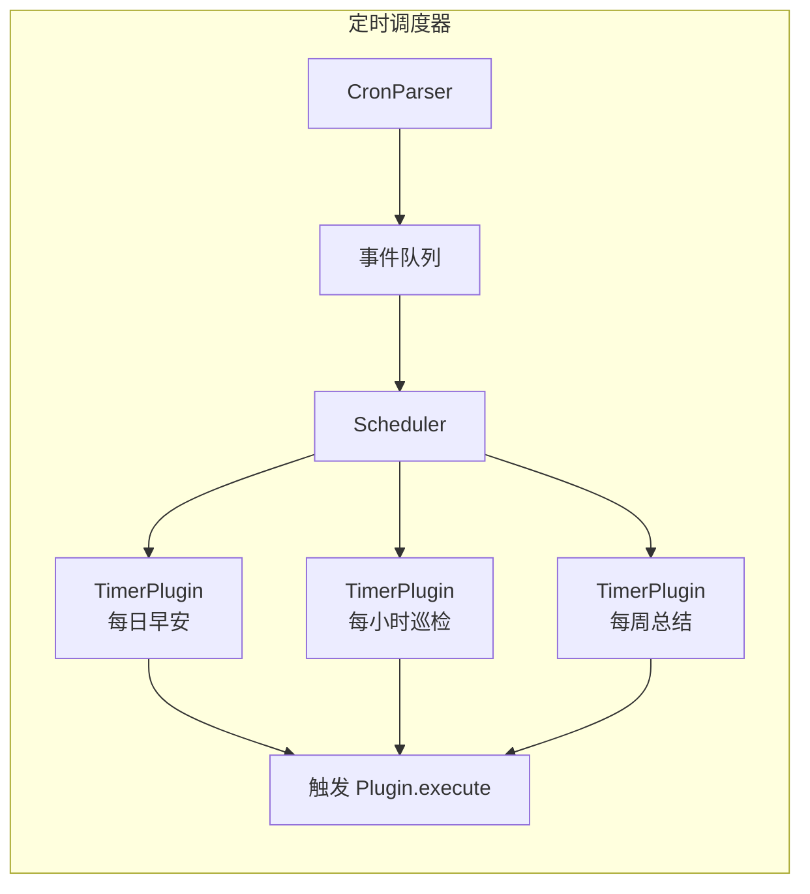

### 9.3 Webhook 接收流程

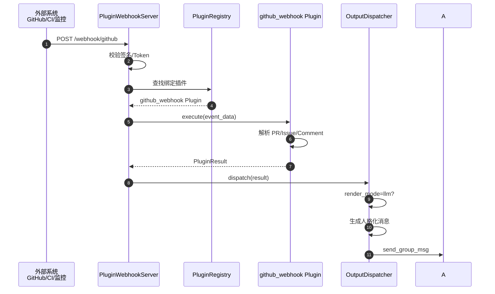

---

## 10. 安全与权限模型

### 10.1 多层权限检查

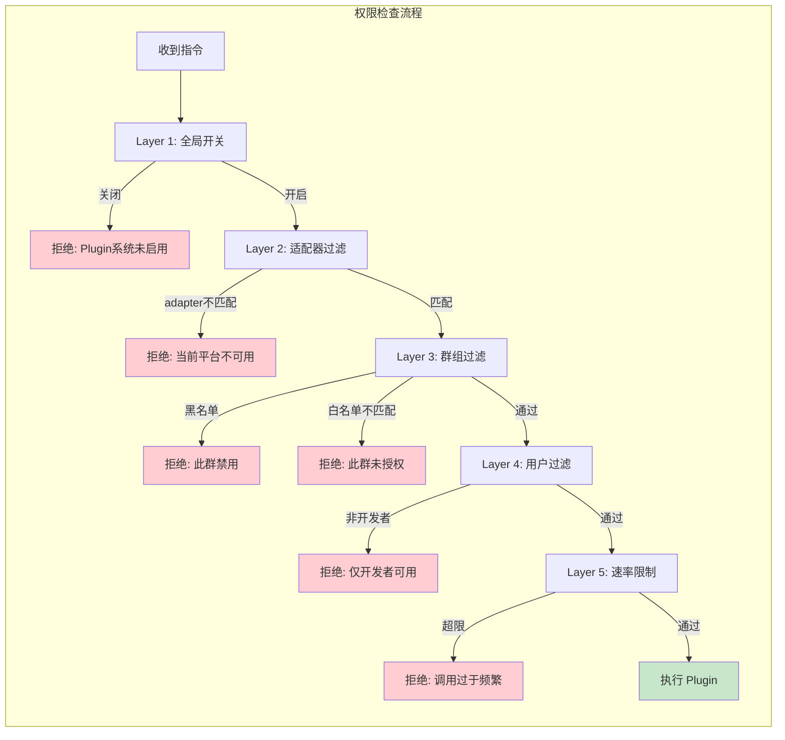

### 10.2 沙箱与资源隔离

| 隔离维度 | 机制 |
|---------|------|
| **文件系统** | Plugin 只能访问 `{work_path}/plugins/{name}/` 及其子目录 |
| **网络** | 无限制（Plugin 自行管理），但建议声明 `network_permissions` |
| **内存** | 共享进程，异常由 Executor 捕获 |
| **CPU** | 执行超时（默认 30s），可配置 |
| **数据存储** | 独立 `PluginDataStore`，JSON 文件隔离 |
| **依赖** | 可选独立 venv，或共享主环境 |

---

## 11. Pipeline 集成点

### 11.1 双路径集成架构

Plugin 系统通过**两条互补路径**与现有 Pipeline 集成：

| 路径 | 触发条件 | 处理位置 | 适用场景 |
|------|---------|---------|---------|
| **路径A：Adapter层快速拦截** | 精确指令（`/天气`、`#roll`） | `napcat_adapter._process_message()` | 零延迟，确定性指令 |
| **路径B：Cognition层融合识别** | 自然语言（"帮我查下天气"） | `_cognition()` 内部 | 口语化表达，需LLM理解 |

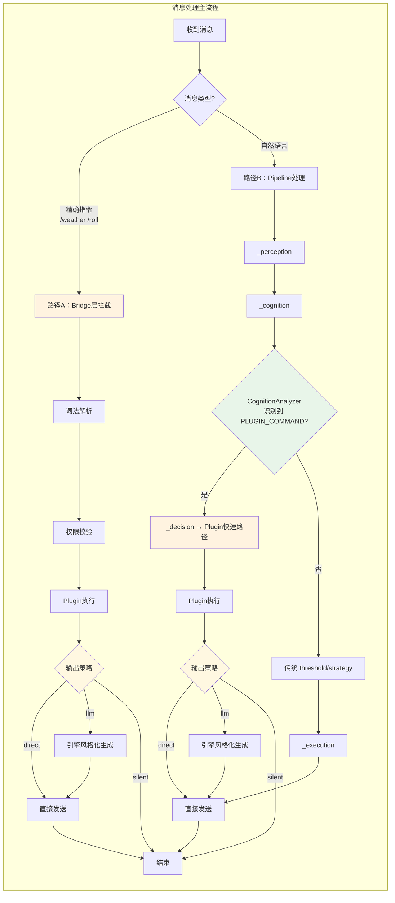

### 11.2 关键集成代码位置

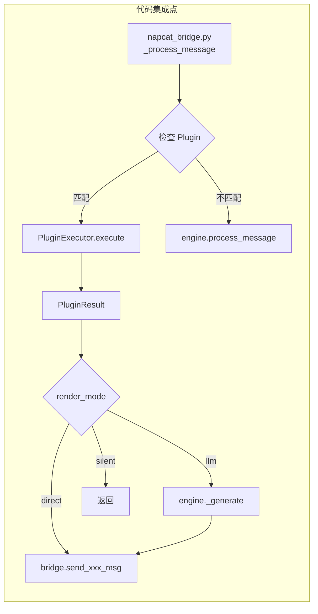

---

## 12. MVP 实施路线图

### 12.1 阶段划分

| 阶段 | 内容 | 预计工作量 | 产出 |
|------|------|-----------|------|
| **Phase 1** | 核心框架：数据模型、Lexer/Parser、Registry、Loader | 3-4 天 | `sirius_chat/plugins/` 基础包 |
| **Phase 2** | 执行引擎：Executor、Context、AdapterProxy | 2-3 天 | Plugin 可执行，支持 direct 模式 |
| **Phase 3** | LLM 集成：PromptFactory 扩展、风格化生成 | 1-2 天 | 支持 llm 模式 |
| **Phase 4** | 事件系统：Timer、Webhook、EventBus | 2-3 天 | 支持事件触发型 Plugin |
| **Phase 5** | NapCat 集成：完整 AdapterProxy、权限层 | 2-3 天 | QQ 群管理、文件等高级 API |
| **Phase 6** | WebUI 管理：Plugin 开关、日志、热重载 | 2-3 天 | 可视化 Plugin 管理 |

### 12.2 模块依赖图

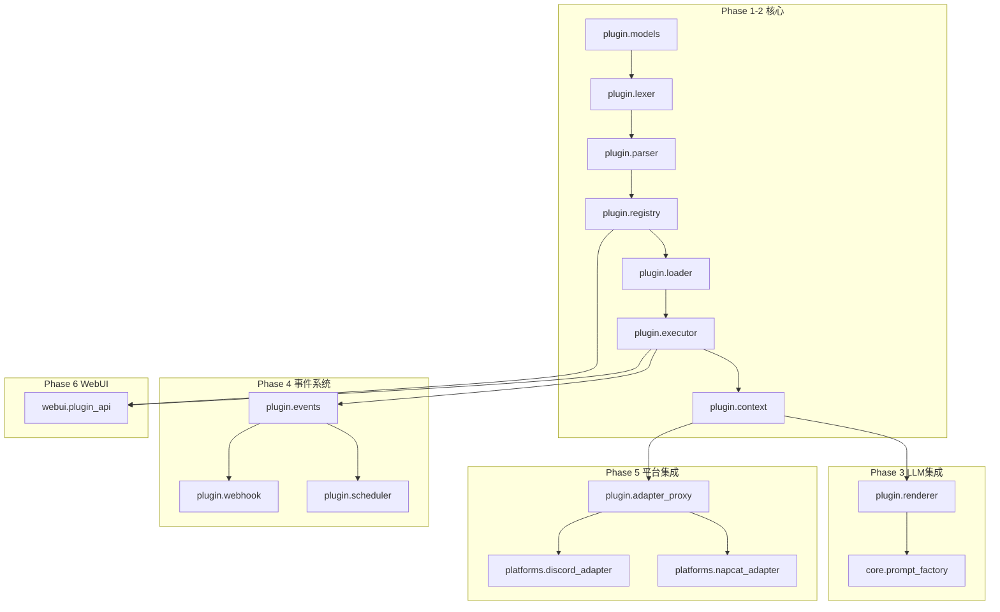

### 12.3 最小可运行示例（Phase 1-2 完成后）

```python
# data/personas/test/plugins/hello/__init__.py
from sirius_chat.plugins import PluginBase, PluginResponse
from sirius_chat.plugins.decorators import command


class HelloPlugin(PluginBase):
    _plugin_name = "hello"
    _plugin_display_name = "问候插件"

    @command("hello", patterns=["/hello", "你好"], render_mode="direct")
    def hello(self, name: str = "朋友") -> PluginResponse:
        return PluginResponse.ok(text=f"你好呀，{name}！我是 {self.ctx.engine.get_persona_name()}~")
```

---

## 13. 自然语言意图识别（无 LLM）

### 13.1 问题背景

Plugin 系统需要处理两类触发方式：

1. **精确指令**：`/天气 北京`、`#roll 2d6+3` —— 词法解析即可处理
2. **自然语言**：`月白，帮我查一下无锡的天气`、`无锡明天会下雨吗` —— 需要意图识别 + 槽位填充

第 4 章的词法分析层只解决第 1 类。本章讨论第 2 类的纯算法方案，**不调用远程 LLM**，以保证零成本和低延迟。

### 13.2 核心挑战

中文自然语言的语序极其灵活：

| 输入 | 意图 | city | date |
|------|------|------|------|
| `查查明天无锡的天气` | weather | 无锡 | 明天 |
| `月白，今天的无锡的天气怎么样？` | weather | 无锡 | 今天 |
| `无锡明天会下雨吗` | weather | 无锡 | 明天 |
| `明天无锡天气如何` | weather | 无锡 | 明天 |
| `查一下天气` | weather | ? | ? |

**关键约束**：
- **不允许追问确认**（避免用户感知到"机器人在问我"）
- **命中即执行**，未命中则静默 fallback 到传统 Pipeline
- **零 API 成本**，纯本地计算

### 13.3 三层级联匹配架构

```mermaid
flowchart TD
    A[用户消息] --> B[预处理<br/>去称呼/分词/归一化]
    B --> C[第一层：精确指令匹配]
    
    C -->|命中| D[confidence=1.0<br/>直接执行]
    C -->|未命中| E[第二层：模板匹配]
    
    E -->|命中| F[confidence=0.8<br/>直接执行]
    E -->|未命中| G[第三层：语义相似度]
    
    G -->|>=0.85| H[直接执行]
    G -->|0.5~0.85| I[静默 fallback<br/>走传统 Pipeline]
    G -->|<0.5| I
    
    D --> J[Plugin 执行]
    F --> J
    H --> J
    I --> K[EmotionalGroupChatEngine<br/>情感引擎回复]
```

#### 第一层：精确指令匹配（O(1)）

```python
# 插件注册时声明的触发词
triggers = {
    "weather": ["/天气", "#天气", "查天气", "天气怎么样"],
    "roll":    ["#roll", "掷骰子", "roll"],
    "remind":  ["/提醒", "提醒我", "设置提醒"],
}

# 用 Trie 树或 HashSet 做前缀/包含匹配
def exact_match(text: str) -> Optional[MatchResult]:
    for intent, keywords in triggers.items():
        for kw in keywords:
            if text.startswith(kw) or kw in text:
                return MatchResult(intent=intent, confidence=1.0)
    return None
```

#### 第二层：模板匹配（正则 + 捕获组）

```python
templates = {
    "weather": [
        # 查查{ city }的天气
        r"(?:查|看|搜).{0,3}(.+?)(?:的)?天气",
        # { city }天气怎么样
        r"(.+?)(?:这里|那边)?天气怎么样",
        # { date }{ city }的天气 / { city }{ date }天气
        r"(今天|明天|后天)?(.+?)(?:的)?天气",
        r"(.+?)(今天|明天|后天)(?:的)?天气",
        # { city }明天会下雨吗
        r"(.+?)(明天|今天).{0,2}(?:下雨|下雪|晴|冷|热)",
    ],
    "remind": [
        r"(?:提醒|叫|让).{0,5}我.{0,3}(.+)",
        r"(\d+)[点:：](\d+).{0,3}(?:提醒|叫).{0,3}(.+)",
    ]
}
```

**关键设计**：模板必须足够覆盖常见语序，但不过度宽松导致误触发。

#### 第三层：语义相似度（Jaccard / TF-IDF）

```python
def semantic_match(query: str, intent_examples: list[str]) -> float:
    """基于词袋模型的 Jaccard 相似度"""
    query_tokens = set(jieba.cut(query))
    best_score = 0.0
    for example in intent_examples:
        example_tokens = set(jieba.cut(example))
        score = len(query_tokens & example_tokens) / len(query_tokens | example_tokens)
        best_score = max(best_score, score)
    return best_score
```

插件开发者在类属性中提供示例语料：

```python
class WeatherPlugin(PluginBase):
    _plugin_nl_examples = [
        "帮我查一下{city}的天气",
        "{city}今天会下雨吗",
        "看看{city}的天气预报"
    ]
    _plugin_nl_slots = {
        "city": {"type": "city_name", "required": True},
        "date": {"type": "date", "required": False, "default": "今天"}
    }
```

### 13.4 槽位填充（Slot Extraction）

#### 基于词典的实体识别

```python
import jieba.posseg as pseg

CITY_DICT = {"北京", "上海", "无锡", "杭州", "广州", "深圳", ...}
DATE_PATTERNS = ["今天", "明天", "后天", r"\d{1,2}月\d{1,2}日"]

def extract_slots(text: str, slot_defs: dict) -> dict:
    slots = {}
    words = list(pseg.cut(text))
    
    for slot_name, slot_def in slot_defs.items():
        if slot_def["type"] == "city_name":
            # 方法1：词典匹配
            for city in CITY_DICT:
                if city in text:
                    slots[slot_name] = city
                    break
            # 方法2：jieba 地名识别 (ns)
            if slot_name not in slots:
                for word, flag in words:
                    if flag == 'ns':
                        slots[slot_name] = word
                        break
                        
        elif slot_def["type"] == "date":
            for pattern in DATE_PATTERNS:
                match = re.search(pattern, text)
                if match:
                    slots[slot_name] = normalize_date(match.group())
                    break
                    
        elif slot_def["type"] == "number":
            match = re.search(r"\d+", text)
            if match:
                slots[slot_name] = int(match.group())
    
    return slots
```

#### 基于模板的槽位提取（更精准）

当第二层模板匹配命中时，正则捕获组直接提取参数：

```python
template = r"(?:查|看|搜).{0,3}(.+?)(?:的)?天气"
match = re.search(template, "帮我查一下无锡的天气")
city = match.group(1).strip()  # "无锡"
```

#### 位置规则消解歧义

```python
# "查一下北京到上海的高铁"
# 通过位置：第一个城市名 = from_city，第二个 = to_city
cities = extract_all_cities(text)
if len(cities) >= 2:
    slots["from_city"] = cities[0]
    slots["to_city"] = cities[1]
```

### 13.5 参数完整性校验

```python
def validate_slots(slots: dict, slot_defs: dict) -> tuple[bool, list[str]]:
    """返回 (是否完整, 缺失参数列表)"""
    missing = []
    for name, def_ in slot_defs.items():
        if def_.get("required", False) and name not in slots:
            missing.append(name)
    return len(missing) == 0, missing

# 使用场景
is_complete, missing = validate_slots(slots, slot_defs)
if not is_complete:
    # 参数缺失 → 不执行 Plugin，静默 fallback 到 Pipeline
    # 不追问！让情感引擎用 LLM 自然回复
    return None
```

### 13.6 与 Pipeline 的集成

> **注意**：第 13 章描述的是纯算法意图识别的内部机制。在实际架构中，这些算法被融合到 `CognitionAnalyzer` 内部（详见第 14 章），而不是作为独立的 `NLIntentRouter` 模块存在。
>
> 融合后的 Pipeline 流程见 [第 14.3 节](#143-融合后的-pipeline-流程)。

### 13.7 方案评估

| 维度 | 纯算法方案 |
|------|-----------|
| **延迟** | < 50ms（本地计算） |
| **成本** | 0 |
| **离线可用** | 是 |
| **覆盖率** | 依赖模板质量，约 60-80% |
| **误触发率** | 低（严格阈值 + 参数校验） |
| **未匹配处理** | 静默 fallback，不打扰用户 |
| **适合场景** | 明确的功能型指令 |

**核心权衡**：牺牲覆盖率换取零误触发。未匹配的请求由情感引擎用 LLM 处理，用户体验仍然连贯。

---

## 14. 与现有 CognitionAnalyzer 的融合

### 14.1 现有架构分析

`CognitionAnalyzer` 当前的设计哲学：

> **Rule engine covers ~90% of cases at zero LLM cost. Single LLM fallback covers the remaining ~10% with one cheap call.**

其 `_classify_intent()` 方法将消息分类为四种社交意图：

```python
class SocialIntent(Enum):
    HELP_SEEKING = "help_seeking"   # 求助、提问
    EMOTIONAL = "emotional"         # 表达情绪
    SOCIAL = "social"               # 闲聊、讨论
    SILENT = "silent"               # 无意义 filler
```

Plugin 的意图识别可以**作为第五种社交意图**嵌入这个体系，而不是另起炉灶。

### 14.2 融合方案：新增 PLUGIN_COMMAND 意图

#### Step 1：扩展 IntentAnalysisV3

```python
class SocialIntent(Enum):
    HELP_SEEKING = "help_seeking"
    EMOTIONAL = "emotional"
    SOCIAL = "social"
    SILENT = "silent"
    PLUGIN_COMMAND = "plugin_command"  # 新增

@dataclass(slots=True)
class IntentAnalysisV3:
    # ... 现有字段 ...
    
    # === Plugin 意图识别字段（新增）===
    plugin_intent: str | None = None       # 匹配到的插件意图ID，如 "weather"
    plugin_confidence: float = 0.0         # 插件匹配置信度
    plugin_slots: dict[str, Any] = field(default_factory=dict)  # 提取的参数槽位
    plugin_render_mode: str = "direct"     # direct | llm | silent
```

#### Step 2：在 Rule Intent 中优先检查 Plugin

```python
def _classify_intent(self, message: str, context_messages: list[dict] | None = None):
    text = message.lower()
    
    # === 新增：Plugin 规则匹配层（最高优先级）===
    # 第一层：精确指令匹配（/天气 #roll）
    if plugin_match := self._plugin_exact_match(message):
        return SocialIntent.PLUGIN_COMMAND, plugin_match, 1.0
    
    # 第二层：模板匹配（查查无锡的天气）
    if plugin_match := self._plugin_template_match(message):
        return SocialIntent.PLUGIN_COMMAND, plugin_match, 0.85
    
    # === 原有逻辑不变 ===
    # help_seeking / emotional / social / silent 分类...
    help_score = 0
    for pat in _HELP_PATTERNS:
        if re.search(pat, text):
            help_score += 1
    # ...
```

#### Step 3：LLM Cognition Prompt 增加 Plugin 识别

```python
_LLM_COGNITION_PROMPT = """分析以下消息的【情感状态】、【社交意图】和【指向性】。

{ai_identity}{conversation_context}消息：{message}

【可用插件指令】
{plugin_descriptions}

要求输出 JSON：
{{
  "valence": -1.0 到 1.0,
  "arousal": 0.0 到 1.0,
  "intensity": 0.0 到 1.0,
  "basic_emotion": "joy|anger|sadness|anxiety|loneliness|neutral",
  "social_intent": "help_seeking|emotional|social|silent|plugin_command",
  "intent_subtype": "...",
  "plugin_intent": "如果 social_intent 是 plugin_command，填写插件ID，否则留空",
  "plugin_slots": {{ "参数名": "参数值" }},
  "urgency_score": 0-100,
  "relevance_score": 0.0-1.0,
  "directed_score": 0.0-1.0,
  "confidence": 0.0-1.0,
  "search_query": "..."
}}
"""
```

这样 LLM 也能识别自然语言形式的插件意图：
- `"月白，帮我查一下无锡的天气"` → `social_intent: "plugin_command"`, `plugin_intent: "weather"`, `plugin_slots: {"city": "无锡"}`
- `"无锡明天会下雨吗"` → 同上

### 14.3 融合后的 Pipeline 流程

```mermaid
flowchart TD
    A[用户消息] --> B[_perception<br/>预处理]
    B --> C[_cognition<br/>认知分析]
    
    subgraph "CognitionAnalyzer.analyze"
        direction TB
        C --> D[Rule Emotion<br/>零成本]
        C --> E[Rule Intent<br/>零成本]
        
        E --> F{Plugin<br/>精确匹配?}
        F -->|是| G[confidence=1.0]
        
        F -->|否| H{Plugin<br/>模板匹配?}
        H -->|是| I[confidence=0.85]
        
        H -->|否| J[LLM Joint Fallback]
        J --> K{LLM识别到<br/>plugin_command?}
        K -->|是| L[confidence=LLM.confidence]
        K -->|否| M[返回传统意图<br/>help/emotional/social/silent]
        
        G --> N{confidence >= 0.8?}
        I --> N
        L --> N
    end
    
    N -->|是| O[返回 PLUGIN_COMMAND]
    N -->|否| M
    
    O --> P[_decision]
    M --> P
    
    P --> Q{intent.social_intent<br/>== PLUGIN_COMMAND?}
    Q -->|是| R[Plugin 快速路径<br/>跳过 threshold/strategy]
    Q -->|否| S[传统 Pipeline<br/>threshold → strategy → execution]
    
    R --> T[Plugin 执行]
    S --> U[LLM 生成回复]
    
    T --> V{render_mode}
    V -->|direct| W[直接发送]
    V -->|llm| X[委托引擎风格化]
    V -->|silent| Y[无输出]
```

### 14.4 _decision() 层的改动

```python
def _decision(self, intent: IntentAnalysisV3, emotion: EmotionState, ...):
    # === 新增：Plugin 命令快速路径 ===
    if intent.social_intent == SocialIntent.PLUGIN_COMMAND:
        return StrategyDecision(
            strategy="plugin",  # 新增策略类型
            should_reply=True,
            priority=10,        # Plugin 命令最高优先级
            reasoning="Plugin command detected",
            plugin_intent=intent.plugin_intent,
            plugin_slots=intent.plugin_slots,
            plugin_render_mode=intent.plugin_render_mode,
        )
    
    # === 原有逻辑不变 ===
    # Rhythm context
    recent_msgs = self._get_recent_messages(group_id, n=10)
    rhythm = self.rhythm_analyzer.analyze(group_id, recent_msgs)
    # ... threshold computation ...
```

### 14.5 关键设计决策

| 问题 | 决策 | 理由 |
|------|------|------|
| Plugin 匹配优先级 | **最高**，在 help_seeking 之前 | 用户输入 `/天气` 明确是要执行指令，不应被分类为 info_query |
| LLM 也做 Plugin 识别？ | **是**，在 prompt 中增加 plugin 字段 | 覆盖自然语言变体，如"月白帮我查下天气" |
| 如何区分"查天气"是闲聊还是指令？ | 有指令词（/天气）→ 100% 指令；自然语言 → LLM 判断或根据 directed_score | 避免过度敏感 |
| Plugin 命中后跳过 Pipeline？ | **是**，跳过 `_cognition` 后续的 threshold/strategy | 指令已明确，不需要情感分析决定回不回复 |
| 未命中 Plugin 怎么办？ | 完全不影响原有流程 | 安全降级 |

### 14.6 代码改动清单

| 文件 | 改动内容 | 影响范围 |
|------|---------|---------|
| `models/intent_v3.py` | `SocialIntent` 新增 `PLUGIN_COMMAND`；`IntentAnalysisV3` 新增 4 个字段 | 数据模型 |
| `core/cognition.py` | `_classify_intent()` 开头增加 Plugin 规则匹配；`_llm_cognition()` prompt 增加 Plugin 描述 | 意图识别 |
| `core/pipeline.py` | `_decision()` 增加 `PLUGIN_COMMAND` 快速路径 | 策略决策 |
| `core/response_strategy.py` | `StrategyDecision` 新增 `plugin_*` 字段；`StrategyType` 新增 `plugin` | 策略模型 |

### 14.7 融合的优势

1. **统一认知出口**：所有意图分析走同一个 `IntentAnalysisV3`，下游不需要关心是 Plugin 还是普通消息
2. **零额外架构成本**：Plugin 只是新增一种 `SocialIntent` 变体，不引入新模块
3. **自然语言支持**：LLM fallback 能处理口语化表达，无需追问确认
4. **完全向后兼容**：未启用 Plugin 时，原有逻辑 100% 不变
5. **成本可控**：规则层零成本，LLM 层复用已有的 cognition 调用

---

## 附录 A：与现有代码的集成清单

| 现有文件 | 修改内容 | 影响 |
|---------|---------|------|
| `napcat_adapter.py` | `_process_message()` 开头增加 Plugin 检查 | 消息处理入口 |
| `engine_core.py` | 新增 `_plugin_registry`、`_plugin_executor` 字段 | 引擎状态 |
| `prompt_factory.py` | 新增 `build_plugin_context()` 方法 | LLM 风格化 |
| `runtime.py` | `_build_engine()` 中初始化 Plugin 运行时 | 引擎构建 |
| `__init__.py` | 导出 Plugin 公开 API | 外部可见性 |

## 附录 B：术语对照

| 术语 | 英文 | 说明 |
|------|------|------|
| 插件 | Plugin | 本系统核心概念，文件夹级扩展包 |
| 指令 | Command | 用户输入的触发文本，如 `/天气 北京` |
| 触发器 | Trigger | 激活 Plugin 的条件（关键词/事件/正则） |
| 渲染模式 | Render Mode | 输出策略：`direct`/`llm`/`silent` |
| 适配器代理 | AdapterProxy | 平台原生 API 的抽象接口 |
| 上下文 | PluginContext | Plugin 执行时的环境对象 |

---

*文档结束*
