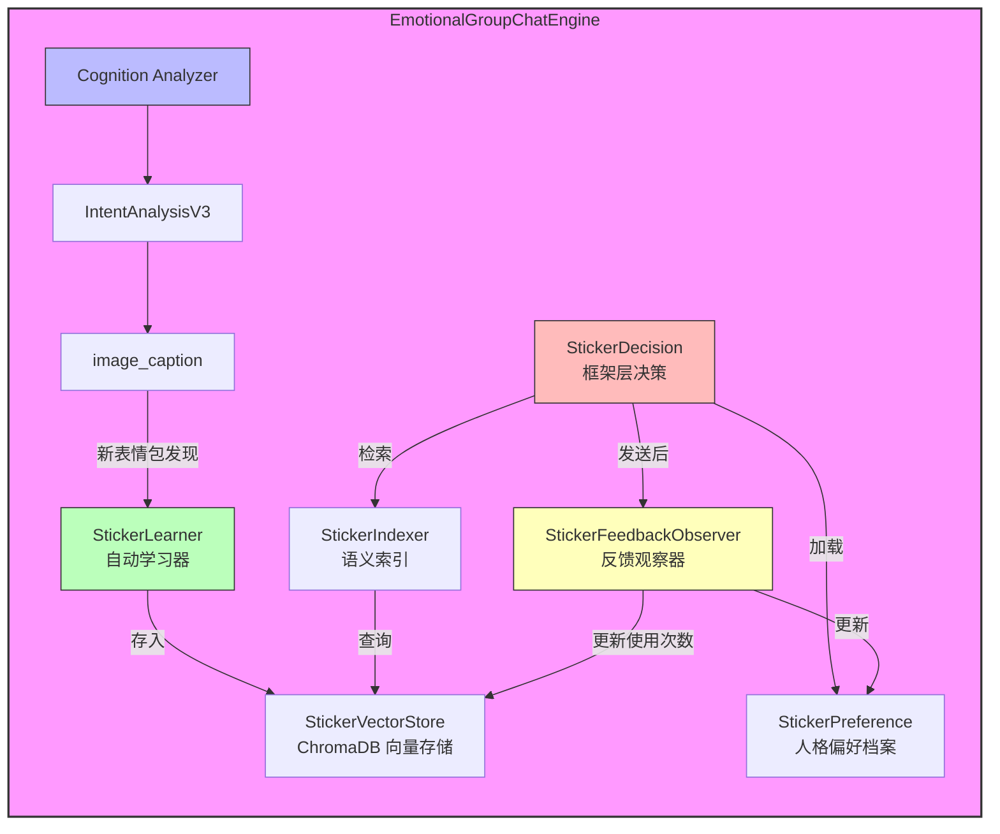
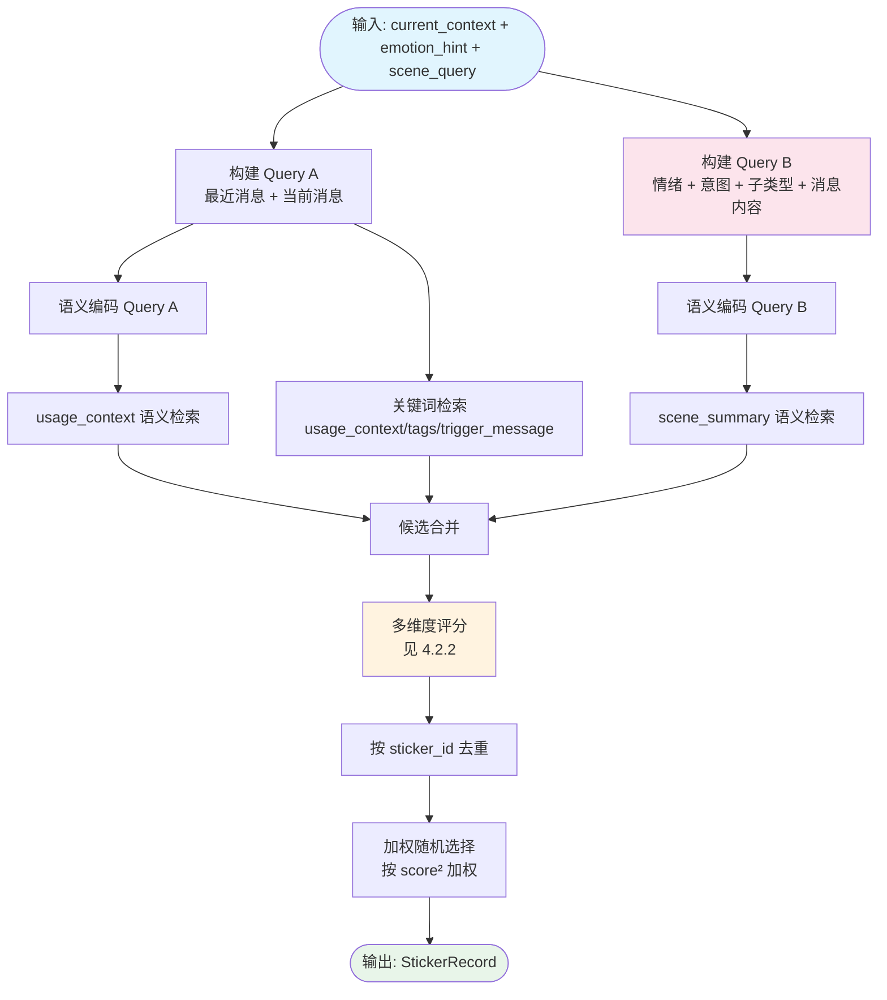
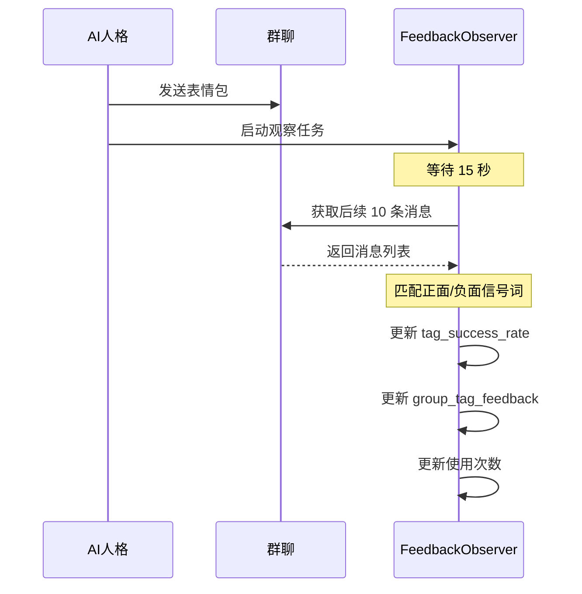
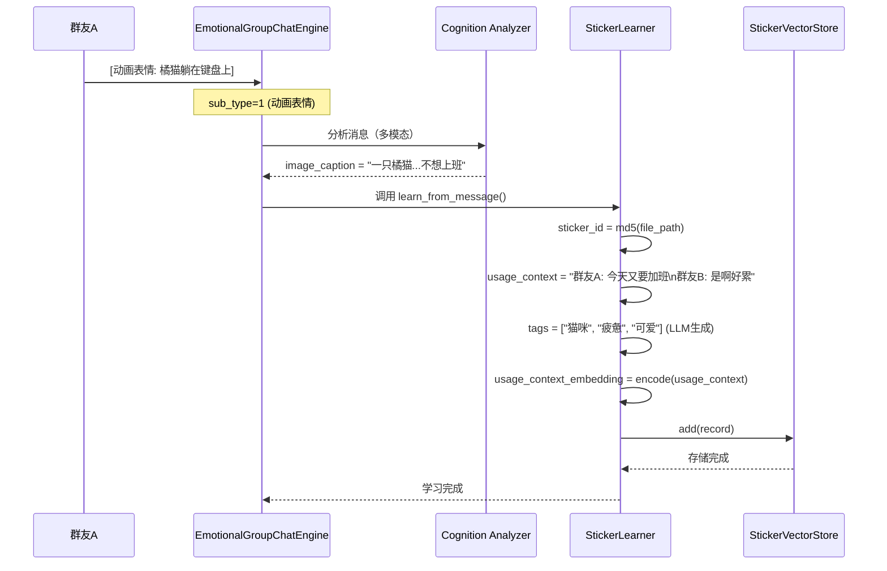
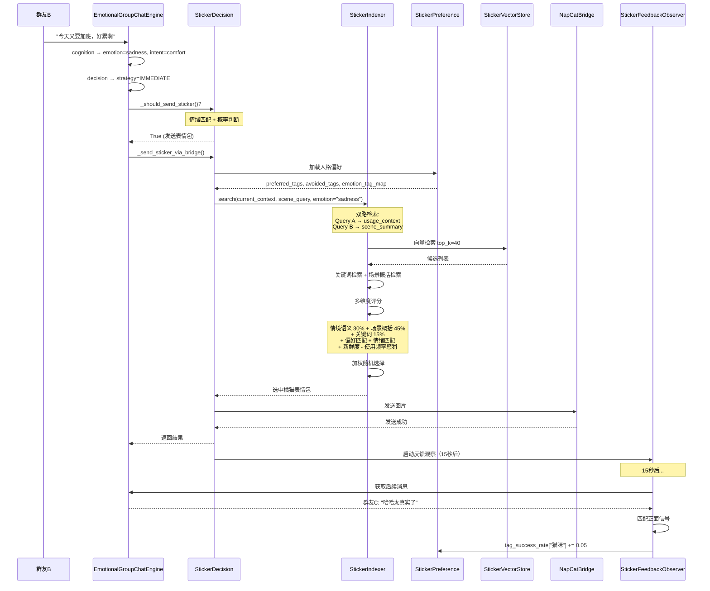

# 表情包 RAG 系统（Sticker RAG System）

> 版本：1.2.0
> 作者：Sirius Chat
> 最后更新：2026-05-04

---

## 1. 系统概述

表情包 RAG 系统是 Sirius Chat 框架的**内置子系统**，赋予 AI 人格**自动学习群聊表情包**、**根据语境智能检索**、**按人格偏好发送**的能力。

核心设计理念：
- **观察学习**：AI 像人类一样，通过观察群友在什么情境下发什么表情包来学习
- **场景概括**：累积足够观察后，LLM 自动生成概括性场景描述，大幅提升检索泛化能力
- **人格化**：不同人格有不同的表情包品味，系统自动维护偏好档案
- **动态适应**：根据群友反馈不断调整，模拟"喜新厌旧"等人类习惯
- **框架层决策**：表情包发送时机与选择完全由框架层独立判断，模型无需感知表情包系统存在

---

## 2. 系统架构



---

## 3. 数据模型

### 3.1 StickerRecord（表情包记录）

```python
@dataclass
class StickerRecord:
    sticker_id: str                    # MD5 哈希，唯一标识
    file_path: str                     # 本地图片路径
    caption: str                       # cognition 生成的图片描述（辅助理解）
    usage_context: str                 # 核心：使用该表情包时的对话情境
    trigger_message: str               # 触发该表情包的消息内容
    trigger_emotion: str               # 触发时的情绪标签
    source_user: str                   # 发送者
    source_group: str                  # 群号
    discovered_at: str                 # 首次发现时间（ISO）
    last_used_at: str | None           # 上次使用时间
    usage_count: int                   # 被当前人格使用次数
    tags: list[str]                    # LLM 提取的标签（情绪/场景/风格）
    usage_context_embedding: list[float]  # 情境检索向量：usage_context 的语义向量
    caption_embedding: list[float]     # 辅助向量：caption 的语义向量
    novelty_score: float               # 新鲜度（0-1，1=全新）
    # --- 场景概括（v1.2 新增） ---
    scene_summary: str                 # LLM 生成的概括性场景描述（100-200字）
    scene_summary_embedding: list[float]  # 场景概括的语义向量
    scene_generalize_count: int        # 已概括次数（上限 3）
```

**存储位置**：`data/personas/{persona_name}/skill_data/stickers/records/{sticker_id}.json`

### 3.2 StickerPreference（人格偏好档案）

```python
@dataclass
class StickerPreference:
    preferred_tags: list[str]        # 喜欢的标签（如"傲娇","猫咪"）
    avoided_tags: list[str]          # 回避的标签（如"卖萌","撒娇"）
    style_weights: dict[str, float]  # 风格权重（cute:0.3, sarcastic:0.7）
    tag_success_rate: dict[str, float]   # 标签→成功率（运行时学习）
    novelty_preference: float        # 喜新程度（0=恋旧，1=追新）
    emotion_tag_map: dict[str, list[str]]  # 情绪→标签映射
    recent_usage_window: list[dict]  # 近期使用记录（模拟"一段时间内偏爱"）
    group_tag_feedback: dict[str, float]   # 群聊标签反馈
```

**存储位置**：`data/personas/{persona_name}/skill_data/stickers/sticker_preference.json`

---

## 4. 核心模块详解

### 4.1 StickerVectorStore（向量存储）

基于 **ChromaDB** 实现，每个人格拥有独立的 collection：

```python
# Collection 命名规则
collection_name = f"sticker_{persona_name}"  # 如 "sticker_傲娇少女"
```

**复用策略**：与日记系统的 `DiaryVectorStore` 共用同一套 ChromaDB 基础设施，但 collection 前缀不同（`sticker_` vs `diary_`），避免数据混淆。

**Embedding 模型**：`BAAI/bge-small-zh`（512 维），与日记系统共用同一模型实例，避免重复加载内存。模型从本地缓存加载，不连接 HuggingFace Hub。

### 4.2 StickerIndexer（语义索引）

#### 4.2.1 检索流程



#### 4.2.2 评分公式

```python
base_score = (
    0.3  * context_score              # Query A ↔ usage_context 语义相似度
  + 0.45 * scene_score                # Query B ↔ scene_summary 语义相似度（最可信）
  + 0.15 * keyword_score              # 关键词匹配
)
final_score = base_score + 偏好/情绪/新鲜度/反馈等独立维度
```

| 维度 | 说明 | 权重 |
|------|------|------|
| 情境语义相似度 | Query A 与 usage_context 的 cosine similarity | 0.3 |
| 场景概括相似度 | Query B 与 scene_summary 的 cosine similarity（LLM 概括，可信度最高） | 0.45 |
| 关键词匹配 | current_context 在 usage_context/tags/trigger_message 中的匹配 | 0.15 |
| 偏好标签奖励 | preferred_tags 命中 +0.12/个 | - |
| 回避标签惩罚 | avoided_tags 命中 -0.2/个 | - |
| 标签成功率 | tag_success_rate 偏离 0.5 的部分 * 0.1 | - |
| 情绪匹配 | emotion_tag_map 命中 +0.15/个 | - |
| 新鲜度 | novelty_score * novelty_preference * 0.25 | - |
| 使用频率 | usage_count * 0.06，上限 0.35 | - |
| 近期使用 | 近期窗口内使用 >=3 次，额外惩罚 | - |
| 群聊反馈 | group_tag_feedback 偏离 0.5 的部分 * 0.08 | - |

### 4.3 StickerLearner（自动学习器）

#### 4.3.1 学习触发条件

在 `_background_update` 中检测：
```python
if intent.image_caption and getattr(message, "multimodal_inputs", None):
    self._learn_sticker_from_message(message, intent, group_id, user_id)
```

即：**消息包含动画表情（`sub_type=1`）且 cognition 成功生成了图片描述**。

> **注意**：只有动画表情（`sub_type=1`）会被学习，普通图片（`sub_type=0` 或不存在）不会被当作表情包处理。这是因为普通图片（如照片、截图）通常不具备表情包的表达性和复用性。

#### 4.3.2 情境构建

学习时，从群聊上下文中构建 `usage_context`：

```python
def _build_usage_context(self, group_id, trigger_message, source_user):
    context_parts = []
    # 获取最近 3 条消息
    if self._basic_memory is not None:
        recent = self._basic_memory.get_recent_messages(group_id, limit=3)
        for msg in recent:
            context_parts.append(f"{speaker}: {content}")
    # 追加触发消息
    context_parts.append(f"{source_user}: {trigger_message}")
    return "\n".join(context_parts)
```

**核心思想**：记录的不是"表情包画了什么"，而是"在什么对话情境下有人发了这个表情包"。例如：
- 群友说"今天又要加班"后，有人发了"猫咪瘫倒"的表情包
- 群友说"哈哈哈"后，有人发了"笑哭"的表情包

这样 AI 检索时，就能在类似情境下找到合适的表情包。

#### 4.3.3 标签生成

**有 LLM 时**（推荐）：
```python
prompt = f"""
表情包描述：{caption}
使用情境：{usage_context}
发送者：{source_user}

提取 3-5 个标签，涵盖情绪、场景、风格。
输出 JSON：{{"tags": ["标签1", ...]}}
"""
```

**无 LLM 时**（降级）：基于关键词映射的简单提取：
- 情绪关键词：开心、难过、生气、无奈、疲惫、惊讶...
- 风格关键词：猫咪、狗狗、可爱、沙雕、正经...

#### 4.3.4 场景概括学习（v1.2 新增）

**核心问题**：原始的 usage_context 只记录"这一次的对话情境"，embedding 只能匹配极其相似的对话。场景概括通过 LLM 综合多次观察，生成概括性的场景描述，大幅提升检索泛化能力。

**触发条件**：
- 该 `sticker_id` 的总观察记录数 >= 8（每次学习是一条新记录）
- 已概括次数 < 3（每个表情包最多概括 3 次）
- 每累积 8 次观察触发一次概括（第 8、16、24 次）

**概括流程**：
1. 收集该 `sticker_id` 的所有已有 usage_context
2. 调用 LLM 生成 100-200 字的场景概括（含情绪氛围、社交意图、适合话题等）
3. 第 2/3 次概括时，将之前的概括也传给 LLM，让它扩展而非重写
4. 计算场景概括的 embedding（`bge-small-zh`，与其他 embedding 共用模型）
5. 同步更新该 `sticker_id` 下所有记录的 `scene_summary` 和 `scene_summary_embedding`

**示例效果**：

| 观察次数 | 场景概括 |
|---------|---------|
| 8次 | "适合在表达不想工作、疲惫、慵懒时使用，也适合在轻松闲聊中卖萌或表达无奈时使用" |
| 16次 | "适合在朋友间互相抱怨工作压力、表达疲惫不想动、午睡犯困时使用。也适合在轻松闲聊中表达慵懒、卖萌或无奈的情绪，带有可爱和放松的氛围。在讨论摸鱼、摆烂、不想上班等话题时也能自然融入" |

**LLM Prompt**：
```python
_SCENE_GENERALIZE_PROMPT = """
你是一个表情包使用场景分析专家。根据以下信息，概括这个表情包适合使用的场景。

图片描述：{caption}
已有标签：{tags}
使用情境记录：
{usage_contexts}

{previous_summary_section}  # 第 2/3 次时包含之前的概括

要求：
1. 不要局限于已有情境，要推理出更多相似的使用场景
2. 涵盖情绪氛围、对话节奏、社交意图、适合的话题等维度
3. 用一段自然流畅的中文描述，100-200字
"""
```

### 4.4 StickerPreferenceManager（偏好管理）

#### 4.4.1 偏好自动生成

在 Engine 初始化时，如果偏好文件不存在，自动调用 LLM 生成：

```python
prompt = f"""
人格名称：{persona.name}
性格特点：{persona.personality_traits}
说话风格：{persona.communication_style}
社交角色：{persona.social_role}
幽默风格：{persona.humor_style}

推断该角色喜欢的表情包风格。
输出 JSON：
{{
  "preferred_tags": [...],
  "avoided_tags": [...],
  "style_weights": {{...}},
  "novelty_preference": 0.5,
  "emotion_tag_map": {{...}}
}}
"""
```

#### 4.4.2 运行时学习

| 学习类型 | 触发条件 | 更新内容 |
|----------|----------|----------|
| 使用记录 | 每次发送表情包 | recent_usage_window |
| 标签成功率 | 反馈观察后 | tag_success_rate |
| 群聊反馈 | 反馈观察后 | group_tag_feedback |

### 4.5 StickerFeedbackObserver（反馈观察器）

#### 4.5.1 观察流程



#### 4.5.2 信号词

**正面**："哈哈", "笑死", "确实", "太真实了", "保存了", "好图", "绝了", "妙啊", "可以", "不错"

**负面**："?", "无语", "尴尬", "冷", "没意思", "不好笑", "算了"

#### 4.5.3 新鲜度衰减（每小时后台任务）

```python
base_decay = 0.95 ** days_since_discovery      # 随发现时间衰减
usage_decay = 0.9 ** usage_count                # 随使用次数衰减
time_decay = 0.98 ** days_since_used            # 随未使用时间衰减
novelty_score = max(0.1, base_decay * usage_decay * time_decay)
```

---

## 5. 框架层决策接口

### 5.1 决策流程

表情包发送完全由框架层在 `_execution` 阶段独立决策，模型无需感知：

```python
# 1. 判断是否适合发送表情包
if self._should_send_sticker(decision, emotion, intent, group_id):
    emotion_hint = self._emotion_to_sticker_hint(emotion)
    # 2. 构建当前对话上下文（Query A）
    current_context = "\n".join(recent_messages)
    # 3. 构建场景查询（Query B，从 cognition 结果提取，无额外 LLM 调用）
    scene_query = self._build_sticker_scene_query(emotion, intent, message_content)
    # 4. 双路检索异步发送（fire-and-forget）
    asyncio.create_task(
        self._send_sticker_via_bridge(group_id, emotion_hint, current_context, scene_query)
    )
```

**Query B 构建**（`_build_sticker_scene_query`）：从已有的 emotion/intent 结果中提取场景特征，无需额外 LLM 调用：
```
"情绪: sadness | 意图: emotional | 子类型: seeking_empathy | 对话内容: 今天又要加班，好累啊"
```

### 5.2 时机判断规则（`_should_send_sticker`）

| 条件 | 行为 |
|------|------|
| 私聊（`private_` 前缀） | 不发送 |
| 策略为 SILENT | 不发送 |
| sarcasm_score > 0.6 或 entitlement_score < 0.3 | 不发送（避免误读） |
| 基础概率 15% | 起始概率 |
| 正向情绪（joy/excitement/surprise 或 valence > 0.3） | +25% |
| 高唤醒（arousal > 0.6） | +20% |
| 中等唤醒（arousal > 0.4） | +10% |
| **上限** | **70%** |

### 5.3 情绪映射（`_emotion_to_sticker_hint`）

| 情绪状态 | 映射结果 |
|----------|----------|
| basic_emotion 有值 | 转为小写字符串 |
| valence > 0.3 且 arousal > 0.5 | "joy" |
| valence < -0.3 | "sadness" |
| arousal > 0.6 | "anger" |
| 其他 | "neutral" |

### 5.4 发送流程（`_send_sticker_via_bridge`）

```python
# 1. 加载人格偏好
preference = preference_manager.load()
# 2. 双路检索最匹配的表情包
record = indexer.search(
    current_context=current_context,
    preference=preference,
    emotion_hint=emotion_hint,
    top_k=20,
    similarity_threshold=0.5,
    scene_query=scene_query,
)
# 3. 通过 NapCatBridge 发送
msg = [{"type": "image", "data": {"file": str(file_path), "sub_type": "1"}}]
await adapter.send_group_msg(group_id, msg)
# 4. 记录使用并启动反馈观察
preference_manager.record_usage(record.sticker_id, record.tags, emotion_hint)
asyncio.create_task(
    feedback_observer.observe(record.sticker_id, group_id, sent_at, wait_seconds=15.0)
)
```

---

## 6. 集成点

### 6.1 Engine 初始化（engine_core.py）

```python
def _init_sticker_system(self) -> None:
    from sirius_chat.skills.sticker import init_sticker_system
    self._sticker_system = init_sticker_system(
        work_path=self.work_path,
        persona_name=self.persona.name,
        provider_async=self.provider_async,
        basic_memory=self.basic_memory,
    )
    # 自动生成偏好（如果不存在）
    pref_manager = self._sticker_system.get("preference_manager")
    if pref_manager and not pref_manager._file_path.exists():
        asyncio.create_task(
            pref_manager.generate_from_persona(self.persona, self.provider_async)
        )
```

### 6.2 消息处理（pipeline.py）

```python
# _execution 阶段末尾：框架层独立决策表情包
if self._should_send_sticker(decision, emotion, intent, group_id):
    emotion_hint = self._emotion_to_sticker_hint(emotion)
    # ...构建 current_context（Query A）...
    scene_query = self._build_sticker_scene_query(emotion, intent, message.content)
    asyncio.create_task(
        self._send_sticker_via_bridge(group_id, emotion_hint, current_context, scene_query)
    )

# _background_update：学习新表情包
def _background_update(self, group_id, message, emotion, intent, user_id):
    # ... 其他更新 ...
    
    # Sticker learning: only animated stickers (sub_type=1)
    if intent.image_caption and getattr(message, "multimodal_inputs", None):
        self._learn_sticker_from_message(message, intent, group_id, user_id)
```

### 6.3 后台任务（bg_tasks.py）

```python
async def _bg_sticker_novelty_updater(self) -> None:
    """每小时更新一次新鲜度分数"""
    interval = 3600  # 秒
    while self._bg_running:
        await asyncio.sleep(interval)
        await feedback_observer.update_novelty_scores()
```

---

## 7. 数据存储

### 7.1 目录结构

```
data/personas/{persona_name}/
└── skill_data/
    └── stickers/                    # 表情包系统工作目录
        ├── records/                 # JSON 格式的 StickerRecord
        │   ├── a1b2c3d4.json
        │   └── e5f6g7h8.json
        ├── vector_store/            # ChromaDB 持久化
        │   ├── chroma.sqlite3
        │   └── ...
        └── sticker_preference.json  # 人格偏好档案
```

### 7.2 人格隔离

- **向量存储**：每个人格独立的 ChromaDB collection（`sticker_{persona_name}`）
- **记录文件**：每个人格独立的 records 目录
- **偏好档案**：每个人格独立的 sticker_preference.json

---

## 8. 使用示例

### 8.1 群友发送表情包（自动学习）



### 8.2 AI 发送表情包（框架层决策）



---

## 9. 配置项

| 配置项 | 默认值 | 说明 |
|--------|--------|------|
| sticker_novelty_update_interval_seconds | 3600 | 新鲜度更新间隔（秒） |

---

## 10. 故障排除

| 问题 | 可能原因 | 解决方案 |
|------|----------|----------|
| 表情包检索为空 | 库中无记录 | 等待群友发送表情包自动学习，或手动导入 |
| 向量存储初始化失败 | chromadb 未安装 | `pip install chromadb` |
| 模型加载失败 | Embedding 服务不可用 | 检查 Embedding 服务是否启动（`python -m sirius_chat.embedding`），或查看 EmbeddingClient 连接配置 |
| 标签生成失败 | LLM provider 不可用 | 降级为关键词映射提取 |
| 发送失败 | 图片文件不存在 | 检查 image_cache 目录 |

---

## 11. 未来扩展

1. **多模态 Embedding**：使用 CLIP 等视觉模型直接编码图片，而非依赖文本描述
2. **表情包推荐**：主动推荐新收集的表情包给群友
3. **跨人格共享**：允许人格间共享表情包库，但保留各自偏好
4. **表情包生成**：集成 AI 图像生成，根据语境实时生成表情包
